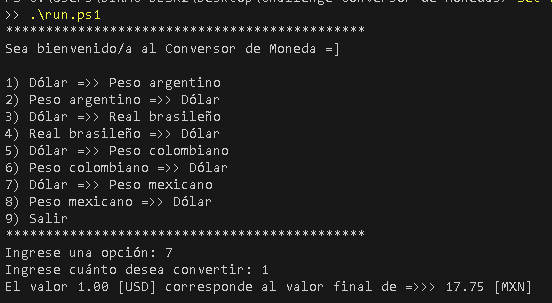

# Conversor de Monedas — Ejemplo Java

Este repositorio contiene un ejemplo simple de Conversor de Monedas en Java 17, usando:

- HttpClient (Java 11+)
- Gson 2.10.1 (para parseo JSON)

Estructura:

```
./
  pom.xml
  src/main/java/challengeconversordemonedas/
    ConversorApp.java
    Conversor.java
    ExchangeRateService.java
```

Requisitos previos
- Java JDK 17+
- Maven (opcional, recomendado)
- Una API KEY para ExchangeRate-API guardado en el archivo `ExchangeRateService.java`.

Configurar la API KEY:

```powershell
API_KEY_FALLBACK = "TU_API_KEY_AQUI";
```

Compilar y ejecutar con Maven:

```powershell
mvn compile
mvn exec:java -Dexec.mainClass="challengeconversordemonedas.ConversorApp"
```

O abrir el proyecto en IntelliJ y ejecutar la clase `ConversorApp` para correr el scrip run.ps1.



Notas sobre IntelliJ (añadir Gson manualmente si no usa Maven):

1. Abre tu proyecto en IntelliJ.
2. Haz clic derecho sobre la carpeta del proyecto en el panel izquierdo.
3. Selecciona "Open Module Settings".
4. Ve a la pestaña "Dependencies".
5. Haz clic en "+" y elige "Library".
6. Busca "gson" y selecciona la versión deseada o añade el JAR.

Seguridad: no dejes la API key en el código fuente ni en repositorios públicos; usa variables de entorno o archivos de configuración ignorados por git.
